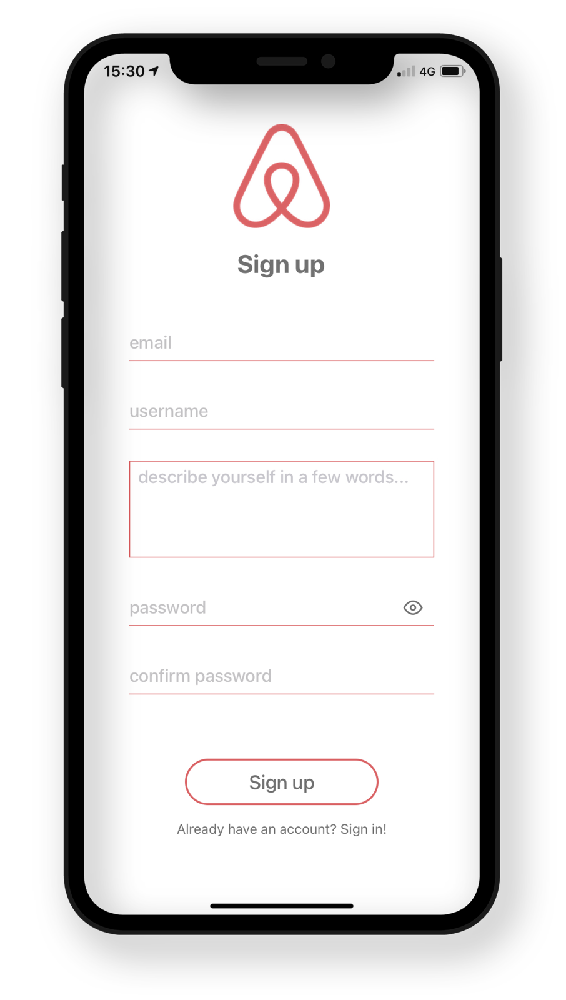
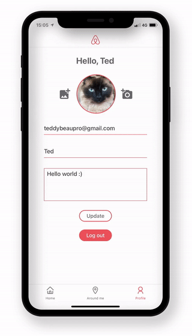

# Airbnb Clone - React Native

<div align="center">
<br />
<br />
React Native frontend project inspired by the Airbnb mobile app.
<br />

</div>

## Features & Stack

### Main features

-  User authentication (login/signup)
-  Browsing through the list of offers
-  Open an offer's details with picture swiper and interactive map
-  Around me interactive map using geolocation
-  User profile (profile picture upload from camera and library, user information update)

### Stack and main packages

-  React Native with Expo
-  async-storage
-  axios
-  expo-image-picker
-  expo-location
-  react-native-maps (Mapview)
-  react-native-swiper-flatlist (image swiper)
-  relying on an external API from [Le Reacteur](https://github.com/lereacteur/express-airbnb) for the data

## Screenshots

<div align="center">



</div>

## Installation and usage

Be sure, you have installed all dependencies and applications to run an Expo project on your computer : [Getting Started with Expo](https://docs.expo.io/get-started/installation/).

This project was developped with a focus on iOS, however it should be working just fine on Android too.

Clone this repository :

```
git clone https://github.com/teddy-beau/airbnb.git
cd tinder-expo
```

Install packages with **yarn**:

```
yarn
```

Once the installation is complete, run it:

```
yarn start
```

or:

```
expo start
```

## Backlog

This project is completed ✅

No other features will be implemented.
